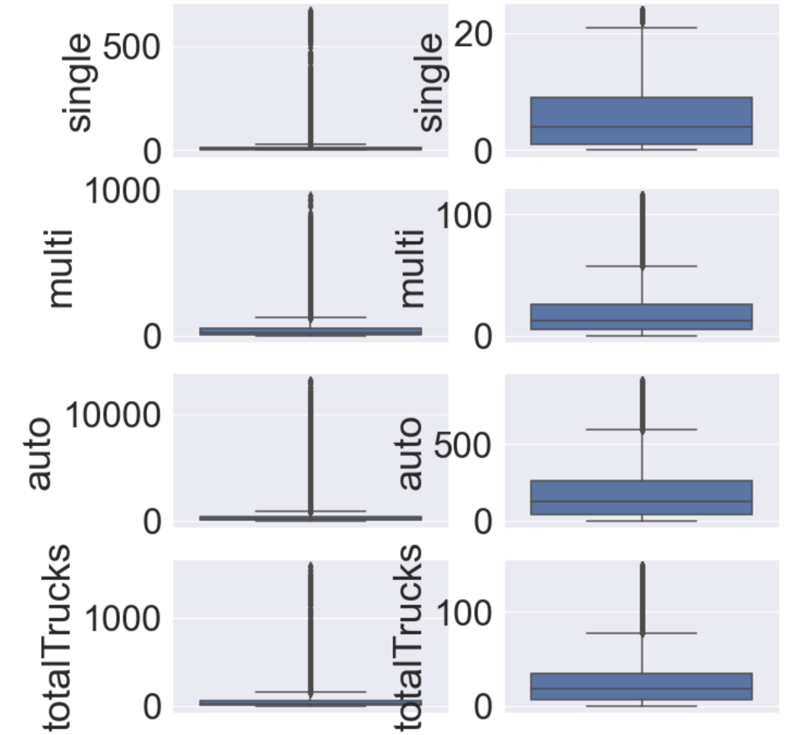

# Traffic in Ontario

Ensuring that people and goods are moved safely across Ontario is one of the major objectives of Ontario’s Ministry of Transportation (MTO). 

We examine a dataset, collected in 2006, containing information on traffic volumes of commercial and private vehicles at different survey stations in Ontario. 

The dataset has one week of average hourly truck and auto volumes data for every hour in a week for the year 2006. 

Our Quest,

* Examine the data set and infer insights about vehicular movement in the province. 
* Identify high Ontario traffic volume at certain peak hours of the day and in certain locations 
* Develop time-series plots of vehicle movement for the week 
* Establish relationships between time and traffic volume. 
* Identify hours of the day when commuters may escape traffic around some of the busiest areas in Ontario.

## Dataset Description

The data set is found at this [link](https://files.ontario.ca/opendata/2006_commercial_vehicle_survey_-_traffic_volumes_at_survey_stations.csv).

   | Field       | Field Description 
| ------------- |-------------|
| `Station ID`      |Unique CVS station number, representing the station from which the data was collected. It takes the form ONXXXX where XXXX is a 4-digit number. There are 104 unique station IDs present in the data set |
| `Station Name`     | Station name; each Station ID carries a station name      |
| `Direction` | This includes four different traffic directions; east, west, north and south.     |
| `MTO Region` | Five regions of MTO (Central, Eastern, Southwestern, Northern, Northwestern)      |
| `Highway or Road` | Highway number or road name. There are 33 unique highways in the data set      |
| `Location` | Description of location     |
| `Day of Week Number` | A number between 1 and 7 representing day of week. 1=Sunday, 7= Saturday      |
| `Hour` | Hour of day, 0 to 23 represents starting hour of the day (e.g. 12 represents 12 P.M. - 1 P.M.)      |
| `Single` | Number of single unit trucks      |
| `Multi` | Number of multi-unit trucks     |
| `Auto` | Number of cars and other passenger vehicles      |
| `Total Trucks` | Sum of single and multi-unit vehicles      |
| `Total Vehicles` | Number of total vehicles      |


## Data Analysis

Below is a description of the data

> The data does not seem to have any null values

```python
data.describe()
```


Below is a sample from the dataset,

```python
data.head()
```


The data under analysis is for a week timeframe in 2006 and has information on following data points,

* 33 highways
* 104 highway stations 
* 5 MTORegions

#### Data Skewness analysis (and logarithm scale to the rescue)

A simple facet grid shows the data skew,

```python
g = sns.FacetGrid(vehicles, col="variable", col_wrap= 2, sharey=False, sharex=False, height=10, aspect=2)
```


... a logarithmic transformation yields below,
```python
np.log(data1[['single','multi','auto','totalTrucks','totalVehicles']] + 1)
```


Few insights we gain from this initial take on the data, 
* The distribution of totalVehicles parallels the distribution of auto suggesting that totalVehicles composition is made up more of auto than of any of the other vehicle types. 
* This could mean that there are more autos and passenger vehicles in the province than there are trucks. 
* The totalTrucks histogram shares more similarity with multi than it does with single. This could mean there are more multi trucks in the dataset, and possibly in Ontario, than there are single trucks.

#### Outlier identification
Box plots reveal the outliers in this dataset, however we are not ignoring them as they are valid data.
```python
for item in ['single', 'multi', 'auto', 'totalTrucks']:
    sns.boxplot(y=data[item], ax=ax[i,0])
    sns.boxplot(y=data[item][data[item]<=upper_fence(data[item])-5], ax=ax[i,1])
    i += 1
```


# Analysis

We proceed now to analyse the data based on each of the dimensions below,

* Stations
* Highways
* Directions
* Regions
* Day and Time of day

## Stations

### Station with large volume of data

```python
sns.set(font_scale = 1)
ax = stationsTraffic[:40]['trafficPercentage'].plot(kind='bar', figsize=(15,6))
plt.savefig('Percentage_Traffic_per_Station.png')
plt.show()
```


> we can establish that auto contributes the most traffic of all the kinds of vehicles for this dataset.

### Station with high auto volume

```python
ax = stationsTraffic[['single', 
                      'multi', 
                      'auto']][:10].plot(kind='bar', figsize=(15,8))
plt.show()
```


> Most stations show higher auto traffic than they do of other kinds of vehicles. ON0115 and ON0116 are some of the stations with the biggest auto traffic. Station ON0033 appears to have somewhat significant truck traffic. 

### Correlations ?

```python
xcorr_values.loc[i,j] = np.corrcoef(data['totalVehicles'][data['stationID'] == i],
             data['totalVehicles'][data['stationID'] == j]
            )[0,1]
```


> Average correlations more than 70%, it appears traffic rises pretty much at the same rate all over the province and then settles back.
For ex. ON0026 and ON0027 correlates rather highly with traffic at ON0115

### How about time series analysis on traffic data ?

```python
data[data.stationID == 'ON0021'][25:50].reset_index()[['auto']].plot(figsize=(7,5))
```


> ON0021 is located on Hwy 400 between King Rd & Kettleby Rd north of Vaughan. This spike looks to be the daily northerly homeward traffic from downtown Toronto 

>A driver who cares to avoid this traffic 
>* Can take alternative route as this traffic seems a daily occurence. 
>* He might as well leave the office just as the sharp traffic peak is settling after 1500hrs.

## Highways - ON0115

```python
data[data.stationID == 'ON0115'].highway[:4]
```

>  ON0115 located on Hwy 401 is the biggest daily traffic station.

### Hwy 401 Traffic distribution

```python
ax[i//2, i%2].plot(data[['single', 
                             'multi', 
                             'auto', 
                             'totalTrucks']][(data['highway'] == 'Hwy 401') & (data['stationID'] == j)], 
                       label=j)
    ax[i//2, i%2].set_title(j, fontsize=13)
```


## Research Questions

Some of the research questions we examined include: 

1. Which station records the highest volume of traffic? What proportion of vehicles makes up the highest traffic volume? 

2. Which highway experiences the highest traffic volume? What proportion of vehicles makes up the highest traffic volume? 

3. What does the daily traffic distribution for each station look like? 

4. On what day of the week is the highest traffic volume registered? 

5. What are the chances of getting stuck in traffic in Toronto downtown when returning from work at 1600hrs in the afternoon? 

6. What is the best time to leave home for work, if working in downtown Toronto? Are there possible favorable alternative routes? 

7. Can we predict the state or nature of traffic on certain highways in the province? 

8. Can we possibly apply clustering to this dataset to see the highway most affected by traffic? 


## Contributors
Contributors to this group project include [manchuran](https://github.com/manchuran), [harrisrahman](https://github.com/harrisrahman), and [Moh-M](https://github.com/Moh-M).

