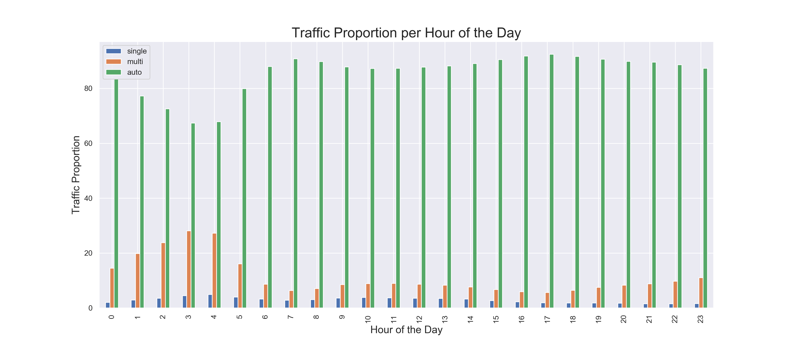

# Traffic in Ontario

Ensuring that people and goods are moved safely across Ontario is one of the major objectives of Ontario’s Ministry of Transportation (MTO). We examine a dataset, collected in 2006 by the MTO, containing information on traffic volumes of commercial and private vehicles at different survey stations in Ontario. 

The dataset has one week of average hourly truck and auto volumes for every hour in a week for the year 2006. 

Our quest:

* Examine the data set and infer insights about vehicular movement in the province. 
* Identify high Ontario traffic volume at certain peak hours of the day and in certain locations 
* Develop time-series plots of vehicle movement for the week 
* Establish relationships between time and traffic volume. 
* Identify hours of the day when commuters may escape traffic around some of the busiest areas in Ontario.

## Dataset Description

The data set can be found at this [link](https://files.ontario.ca/opendata/2006_commercial_vehicle_survey_-_traffic_volumes_at_survey_stations.csv). It contains over 17,000 records and 13 attriubutes. Its attributes are described below.

   | Field       | Field Description 
| ------------- |-------------|
| `Station ID`      |Unique CVS station number, representing the station from which the data was collected. It takes the form ONXXXX where XXXX is a 4-digit number. There are 104 unique station IDs present in the data set |
| `Station Name`     | Station name; each Station ID carries a station name      |
| `Direction` | This includes four different traffic directions; east, west, north and south.     |
| `MTO Region` | Five regions of MTO (Central, Eastern, Southwestern, Northern, Northwestern)      |
| `Highway or Road` | Highway number or road name. There are 33 unique highways in the data set      |
| `Location` | Description of location     |
| `Day of Week Number` | A number between 1 and 7 representing day of week. 1=Sunday, 7= Saturday      |
| `Hour` | Hour of day, 0 to 23 represents starting hour of the day (e.g. 12 represents 12 P.M. - 1 P.M.)      |
| `Single` | Number of single unit trucks      |
| `Multi` | Number of multi-unit trucks     |
| `Auto` | Number of cars and other passenger vehicles      |
| `Total Trucks` | Sum of single and multi-unit vehicles      |
| `Total Vehicles` | Number of total vehicles      |


## Data Analysis

Below is a description of the data

> The data does not seem to have any null values

```python
data.describe()
```


Below is a sample from the dataset showing the first few records.

```python
data.head()
```


The data under analysis is for a week timeframe in 2006 and has information on following data points:

* 33 highways
* 104 highway stations 
* 5 MTO Regions

#### Data Skewness analysis

A simple facet grid shows that the data is heavily skewed to the right.

```python
g = sns.FacetGrid(vehicles, col="variable", col_wrap= 2, sharey=False, sharex=False, height=10, aspect=2)
```


... using logarithmic transformation we are able to gain a better view of the data distribution.
```python
np.log(data1[['single','multi','auto','totalTrucks','totalVehicles']] + 1)
```


Few insights gained from this initial take on the data include: 
* The distribution of `totalVehicles` parallels the distribution of `auto` suggesting that `totalVehicles` composition is made up more of auto than of any of the other vehicle types. 
* This could mean that there are more autos and passenger vehicles in the province than there are trucks. 
* The `totalTrucks` histogram shares more similarity with `multi` than it does with `single`. This could mean there are more `multi` trucks in the dataset, and possibly in Ontario, than there are `single` trucks.

#### Outlier identification
The boxplots reveal some outliers in this dataset, however we will not be removing these as they are valid data.
```python
for item in ['single', 'multi', 'auto', 'totalTrucks']:
    sns.boxplot(y=data[item], ax=ax[i,0])
    sns.boxplot(y=data[item][data[item]<=upper_fence(data[item])-5], ax=ax[i,1])
    i += 1
```


# Analysis

We proceed to analyse the data based on each of the components below,

* Stations
* Highways
* Directions
* Regions
* Day and Time of day

## Stations

### Stations with large volume of traffic

```python
ax = stationsTraffic[:40]['trafficPercentage'].plot(kind='bar', figsize=(15,6))
plt.show()
```


> We establish that stations `ON0115`, `ON0116` and `ON0140` contribute the highest volume of traffic in the province.

### Station with high auto volume

```python
ax = stationsTraffic[['single', 
                      'multi', 
                      'auto']][:10].plot(kind='bar', figsize=(15,8))
plt.show()
```


> We can equally establish that auto contributes the most traffic of all the kinds of vehicles for this dataset. Most stations show higher auto traffic than they do of other kinds of vehicles. `ON0115` and `ON0116` are some of the stations with the biggest auto traffic. Station `ON0033` appears to have somewhat significant truck traffic. 

### Traffic correlations

```python
xcorr_values.loc[i,j] = np.corrcoef(data['totalVehicles'][data['stationID'] == i],
             data['totalVehicles'][data['stationID'] == j]
            )[0,1]
```


> Average traffic correlations is more than 70%. It appears traffic rises pretty much at the same rate all over the province and then settles back uniformly. For example, `ON0026` and `ON0027` correlates rather highly with traffic at `ON0115`.

### How about time series analysis of traffic data?

```python
data[data.stationID == 'ON0021'][25:50].reset_index()[['auto']].plot(figsize=(7,5))
```


> Some peculiarities are visible in the traffic time data. `ON0021`, for example, is located on `Hwy 400` between King Rd & Kettleby Rd north of Vaughan and reports a spike every weekday at 1500hrs. This spike looks to be the daily northerly homeward traffic from downtown Toronto 

>A driver who cares to avoid this traffic 
>* Can take alternative route as this traffic seems a daily occurrence. 
>* He might as well leave the office just as the sharp traffic peak is settling after 1500hrs.

## Highways

```python
data[data.stationID == 'ON0115'].highway[:4]
```

>`ON0115` located on `Hwy 401` is the biggest daily traffic station. This location is just north of Toronto at Keele Street.

<p align="center">
  
</p>

### Hwy 401 Traffic distribution

```python
ax[i//2, i%2].plot(data[['single', 
                             'multi', 
                             'auto', 
                             'totalTrucks']][(data['highway'] == 'Hwy 401') & (data['stationID'] == j)], 
                       label=j)
    ax[i//2, i%2].set_title(j, fontsize=13)
```


The subplots showed that station `ON0115` on `Hwy 401` records some of the biggest traffic. From the cross correlation matrix examined earlier, we observed that some of the other stations correlate greatly with station `ON0015`. Ranking these values in descending order shows that `ON0026` and `ON0027` are some of the other stations with traffic which correlates rather highly with traffic at `ON0115`. This could mean they also register sizeable traffic. We could take a look.

```python
(data.groupby('stationID')
 .mean()
 .loc[['ON0115','ON0032','ON0033', 'ON0026']]
 .iloc[:, 2:]).sort_values(by='totalVehicles', ascending=False)
```


> * Traffic north of `ON0026` appears relatively milder. This is probably because there is a toll and as such is avoided by most drivers. The traffic is therefore much less and seems a good alternative for the traffic-conscious driver. 
> * Station `ON0115` on `Hwy 401` remains heavy with traffic.

### Highways with heavy traffic

Let's sort traffic by highway and arrange the results in order of decreasing mean traffic count. 

The highways with the biggest traffic in Ontario appear to be 
* Hwy 401, 
* QEW, 
* King Edward Ave, and 
* Hwy 400. 

`Hwy 401` runs the length of the south of Ontario extending from its end near Detroit in the United States to the east as far as Ottawa. It apparently is also very busy because it carries traffic westwards and eastwards into Ontario's major city, Toronto.

```
highwayTraffic = (pd.pivot_table(data=data, index='highway', values=['multi', 'auto', 'single', 
                                                    'totalTrucks', 'totalVehicles'], aggfunc='mean')
.sort_values(by='auto', ascending=False))
highwayTraffic['trafficPercentage'] = highwayTraffic['totalVehicles'] * 100 / highwayTraffic['totalVehicles'].sum()
highwayTraffic.sort_values(by='trafficPercentage', ascending=False)[:10]
```


>Hwy 401, QEW and King Edward Ave account for more than 50% of vehicular traffic in the province!


### Hwy 401 - "the well beaten track"  

* Traffic appears to begin around 5am in the morning and increases gently during the day, peaking on major highways around noon. 
* Vehicle density does not seem to reduce until towards evening around 6pm, so that by midnight it goes down significantly. 


>The consistency in these plots suggest that the probability of getting caught in traffic trends higher as the morning arrives. 
>To beat traffic, one would have to be on the road as early as 5-6am. Leaving any sooner or later does not appear to help.


>On the last day of the week, it appears many more cars stay on the road towards evening (parties? night outs?), as it appears vehicle density does not reduce significantly towards the end of this day unlike on others. 

### Highway truck count

Again, `auto` make up the highest vehicle count for every highway. Apparently, it would seem there are many more small cars in the Ontario province than there are trucks. 


However, are there areas in the province where trucks may dominate?

We examine again the distribution of vehicular traffic for each highway and sort by `totalVehicles` and `totalTrucks`. This time we express `totalTrucks` as a fraction of `totalVehicles` to obtain `truckPercentage` for each highway.

```python
highwayTraffic = (data
                  .groupby(by='highway')
                  .mean()
                  .sort_values(by=['totalVehicles', 'totalTrucks'], 
                               ascending=False)[['single','multi','auto','totalTrucks','totalVehicles']])
highwayTraffic['truckPercentage'] = highwayTraffic['totalTrucks'] * 100 / highwayTraffic['totalVehicles']
highwayTraffic.sort_values(by='truckPercentage', ascending=False)[:10]
```


> Hwy 3 - Huron Church Rd, Hwy 402, and Hwy 405 have the highest truck traffic. 

>These highways with huge truck traffic are located close to border toll stations in Ontario. This suggests the presence of significant commercial activity at the borders of the United States and Canada.


## Directions

### Which direction has the heaviest traffic ?

```python
data.pivot_table(index="direction", columns=["dayWeekNo"], values=["totalVehicles"], aggfunc="mean")
```

> The highest traffic goes towards East. 


This is in the direction of downtown Toronto from areas west of GTA.

>Lesser traffic comes westbound into the province, and the least traffic comes from the northern and southern directions. This assumes heavily that most traffic heads towards the city center.

## Regions

```python
ax = data.pivot_table(index="MTORegion", columns=["dayWeekNo"], 
                      values=["totalVehicles"], aggfunc="mean").T.plot(figsize=(10,7))
```


>For every single day of the week, the central MTO region records the highest traffic. Central contributes nearly 70% of the traffic experienced each day in the province.

## Days and Hours

### Days with high traffic volume

Expressed as a percentage, the size of traffic for each day is almost equal. With the exception of the first and last day of the week where traffic is only slightly higher, traffic on other days seems pretty same. Truck traffic also seems significantly lower on these first and last days of the week compared to the other days.

```python
round((((data.groupby('dayWeekNo').mean()).iloc[:, 1:4]).T * 100/ 
 (data.groupby('dayWeekNo').mean()).iloc[:, 1:4].sum(axis=1)).T, 2).plot(kind='bar', figsize=(16,7))
```


> In this case the raw traffic count offers no more insight than the percentage count.

### Hours with high traffic volume

The raw counts show significant decrease in traffic during the morning hours between midnight and 5am. As the morning kicks off, traffic starts to increase, before slowing decreasing towards evening. 

>The highest traffic hours are in fact between 3pm and 6pm, apparently during closing hours.


```python
round((((data.groupby('hour').mean()).iloc[:, 1:4]).T * 100/ 
 (data.groupby('hour').mean()).iloc[:, 1:4].sum(axis=1)).T, 2).plot(kind='bar', figsize=(16,7))
 ```


And proportion-wise?

With this percentage plot we see that the percentage of auto plying the roads decreases somewhat in the morning hours. During this time the percentage of totalTruck traffic actually increases significantly, confirming the reality that most trucks move during the morning hours between 1 to 5. 
>A higher fraction of trucks move during the early morning hours than during the day time. 



## Machine Learning 

### Clustering

We attempt to scale and cluster the data set in order to gain some additional insights.

```python
kmeans = KMeans(n_clusters=10)
kmeans.fit(X)
y_kmeans = kmeans.predict(X)
```

Scatter plots 

```python
    ax[i//2,i%2].scatter(X[attrb], X['totalTrucks'])

    ax[i//2,i%2].set(xlabel=attrb,
                     ylabel='totalTrucks', 
                     title=attrb+' vs. totalTrucks')
    x = np.linspace(0,max(X[attrb]),50)
    y = np.linspace(0,1600,50)
    ax[i//2,i%2].plot(x,y, linewidth=3, linestyle="-.", color='red')
```


>The scatter plot appears to suggest that when there are lesser numbers of `totalTrucks` on the road, they are mostly `multi` trucks. 

>The scatter plot `multi` vs. `totalTrucks` has a slope clost to 1 at lower values. This suggests that the number of `totalTrucks` is almost as much as the number of `multi` at lower traffic areas. As a result, one can infer that there are more `multi` unit trucks on Ontario roads than there are `single` unit trucks, at least at lower traffic areas.

>The `auto` vs. `totalTrucks` scatter plot offers better insight. Clearly, there are many more `auto` than there are other vehicles. At areas of high auto density, it appears traffic of `totalTrucks` is low. This is because there are more scatter points on the south side of this plot than there are on the north end. 


Here is color coded scatter plot based on `stationID`.

```python
plt.scatter(X_scaled[:,2], X_scaled[:,3], c=x1, cmap='viridis')
```


>Areas of high traffic also seem to have `totalTrucks` and `auto` in near equal measure. This could suggest that passenger vehicles and trucks contribute near equal traffic in the province.


`kmeans` does appear to have done an excellent job in correctly clustering the data set into regions from very low traffic to rather high traffic. Lower traffic regions are closer to the origin, while higher traffic regions are away from the origin.

```python
plt.scatter(X_scaled[:,2], X_scaled[:,3], c=y_kmeans, cmap='viridis')
```


## Forecasting

Next, we attempt to forecast traffic on the busiest highway, `Hwy 401`, using the time series data available. We use a simple `fft` algorithm for this task.

```python
data[['single', 'multi', 'auto', 'totalTrucks']][data['stationID']=='ON0115'].plot(figsize=(10,8))
```


## Traffic Probability

We examine the chances of being stuck in traffic on a particular highway. With the volume of data we have this appears to be an analysis we could conduct. We will be using logistic regression for this task and attempting to obtain an average figure.

The log-transformed histograms are a suitable entry into how we may classify the data. Since we do not have a label, we will have to create one. To maintain simplicity we will not be using the results from the 10 clusters earlier created, instead we will just create two labels: 'High Traffic' (or 1) and 'Low Traffic' (or 0).


```python
xdata = data.copy()
xdata['Traffic'] = data1['auto'].apply(lambda x: 1 if x > 5.05 else 0) # class traffic into high or low
```

We fit the model with the training sets.

```python
fit_logit = sm.Logit(y_data_train.values, X_data_train.values)
fit_logit = logitReg.fit()
fit_logit.summary()
```
<p align="center">
   
</p>

>The `coef` for `single` appears to be statistically significant given its low P value. The `coef` of `multi` however is not.


```python
ydata1.groupby('highway').mean()[['proba']].sort_values(by='proba', ascending=False)
```

<p align="center">
  
</p>


Above, we have some idea of what the chances are of being stuck in traffic on the different highways available in the test set. 

>Hwy 401 remains problematic. It registers as the most probable highway one can get stuck in traffic.

Also, some of the highways with low probabilities appear indeed very free compared to the ones with higher probabilities. We obtain some of the traffic variations over the day on these highways and could confirm, for example, that Hwy 138 (with probability of 0.199) rarely experiences heavy traffic. Hwy 401 on the other hand shows intense traffic on weekdays, especially at peak hours.

Using gifs from Google Maps, we are able to see the current state of traffic on some of the highways. Traffic on Hwy 3 - Huron Church Road is shown below here. This is close to the border with the US and apparently has the biggest proportion of truck traffic in Ontario. We see from the data that getting stuck in traffic here is quite high (about 80% from our model). The gif below, taken on a Monday from 0000hrs to 2359hrs suggests this may be true. Green colours represent fast traffic, orange medium and red intense traffic. Because it starts at midnight, the gif progresses from green to orange and then red, as traffic increases.


Another gif taken below of Hwy 401 shows just how heavy traffic can get on this highway. Our probability value of 0.87 seems very reasonable for the level of traffic witnessed.


All of these gifs have been taken from google maps and reflect the current situation of traffic in the province. Our data set, on the other hand, is from 2006. 
>The similarity between our analysis and this most recent data suggests that, at least, the situation of traffic in the province does not seem to have changed very much over time.


# Conclusion

Based on our examination of the data below are the insights we derived.


* Some of the biggest traffic in the province happen on Hwy 401, QEW and King Edward Ave. 

>While these may have the highest density of cars and other passenger vehicles, they do not feature among the list of highways which carry the highest truck traffic. The highways, which have the biggest truck traffic, are much closer to the border of the province than they are to the city center. We also found that passenger vehicle traffic constitute the biggest traffic in the province. More passengers move in the province than do goods. While most traffic happen towards the province's financial district of Toronto, other areas outside of Toronto also have traffic which is just as significant, for example QEW around Hamilton. However, the highest traffic is towards the east. This could also be because of the location of the city's financial district with respect to all other locations. The northern and southern directions carry the least traffic.

* On `Hwy 401` traffic begins to increase at around 5am and peaks at noon. It appears that for the first and last day of the week, the slopes are much gentler than during the other days of the week.

>Could this suggest some lethargy preventing people from hurrying to work on a Monday and more people relaxing at home on the weekends compared to other busy days of the week? The other denser highway traffic on QEW and King Edward Ave seem to confirm this trend. 

>Traffic on the last day of the week also did not peter out in the evening as does traffic on other days, possibly suggesting that more people spent longer nights out during the last day of the week?

* Clustering offers an avenue to cluster the data set into a spectrum ranging from high traffic to minimal traffic based on the size of the traffic for any given hour in a day. 
>This generates an output that could help with labeling the data set and with which further classification could be done if provided with new data set. In such classification task, the output is a categorical variable. Pre-processing tasks such as clustering could be used in designing such output. 

* Traffic prediction on the biggest highway in the province, `Hwy 401`, was conducted using `fft`. 

>The easy predictability of traffic patterns makes the `fft` algorithm a suitable method for this job, as it can easily duplicate repetitive changes characteristic of traffic patterns.

* Finally, we used logistic regression to examine the chances of getting stuck on a particular highway. 

>With the generated model we were able to reinforce our earlier conclusion that `Hwy 401` has the biggest vehicle movement and offers the greatest chance of being stuck in traffic. The probability was as high as 80%. We saw also that some other highways, like Hwy 138, offer the lowest possibility of traffic. `Sample gifs obtained from google maps helped verify our analysis. Comparing our gifs, obtained in 2020, to results from our 2006 data set shows some eerie similarity which suggests that traffic patterns may not have changed that greatly in the province over the past years.


# Contributors
Contributors to this group project include [manchuran](https://github.com/manchuran), [harrisrahman](https://github.com/harrisrahman), and [Moh-M](https://github.com/Moh-M).
